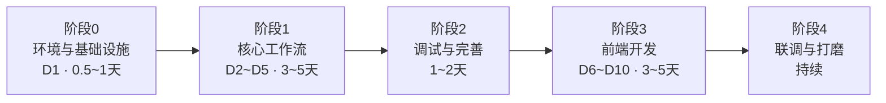

# MVP 开发流程

> 版本：v1.0　|　日期：2026-07-09　|　基于《MVP落地方案.md》
>
> 原则：**后端优先 + 分阶段纵向打通**。每完成一个后端里程碑，就用 Swagger 或最小页面验证一次，避免最后才发现流程卡住。

---

## 目录

1. [总体原则](#1-总体原则)
2. [阶段总览](#2-阶段总览)
3. [阶段 0：环境与基础设施（D1）](#3-阶段-0环境与基础设施d1)
4. [阶段 1：核心工作流（D2–D5）](#4-阶段-1核心工作流d2d5)
5. [阶段 2：后端完善与调试能力](#5-阶段-2后端完善与调试能力)
6. [阶段 3：前端开发（D6–D10）](#6-阶段-3前端开发d6d10)
7. [阶段 4：联调与 Prompt 打磨](#7-阶段-4联调与-prompt-打磨)
8. [时间线参考](#8-时间线参考)
9. [风险与应对](#9-风险与应对)
10. [每阶段验收清单](#10-每阶段验收清单)

---

## 1. 总体原则


| 原则      | 说明                                             |
| ------- | ---------------------------------------------- |
| 后端优先    | 核心复杂度在 LangGraph 工作流、interrupt 恢复、双模型调用，先在后端跑通 |
| 纵向打通    | 按工作流节点顺序逐步开发，每完成一块就端到端验证，不攒到最后                 |
| 先文本、后图片 | 选题 → 文案 → 审核循环稳定后，再接分镜和 Seedream 生图            |
| 前端后置    | API 稳定后再做完整 UI；后端开发期用 Swagger 代替前端             |
| 每步可验证   | 每个 interrupt 断点、每个模型调用都要有明确的验收标准               |


**不推荐**：后端所有 API、所有节点一次性写完，最后才联调。

**推荐**：完成「选题 interrupt」→ Swagger 验证 → 再做「文案节点」→ 再验证 → 以此类推。

---

## 2. 阶段总览




| 阶段   | 周期      | 核心产出           | 验证方式               |
| ---- | ------- | -------------- | ------------------ |
| 阶段 0 | 0.5~1 天 | 环境就绪、双模型可调     | 健康检查 + debug 冒烟    |
| 阶段 1 | 3~5 天   | 完整内容生产流水线（无前端） | Swagger 走完全流程      |
| 阶段 2 | 1~2 天   | 日志、调试端点、内容包导出  | API 调试 + Prompt 初调 |
| 阶段 3 | 3~5 天   | 3 个前端页面        | 运营人员可操作全流程         |
| 阶段 4 | 持续      | 真实内容可发布        | 端到端真实业务测试          |


---

## 3. 阶段 0：环境与基础设施（D1）

**目标**：开发环境就绪，数据库和双模型 API 全部调通。

### 开发步骤


| 序号  | 任务                    | 产出                                        |
| --- | --------------------- | ----------------------------------------- |
| 0.1 | 确认 PostgreSQL 18 服务运行 | `Get-Service postgresql-x64-18` 为 Running |
| 0.2 | 创建项目数据库               | `CREATE DATABASE media_agent;`            |
| 0.3 | `uv` 初始化后端项目          | `pyproject.toml`、`.python-version`、`.env` |
| 0.4 | FastAPI 最小入口          | `main.py` + `/health` 端点                  |
| 0.5 | 数据库连接 + Alembic 迁移    | 业务表 + LangGraph checkpoint 表              |
| 0.6 | 豆包文本 API 连通           | `ark_text.py` + debug 端点                  |
| 0.7 | Seedream 生图 API 连通    | `ark_image.py` + 测试出图                     |


### 验收标准

- [ ] `uv run uvicorn app.main:app --reload` 启动无报错
- [ ] `GET /health` 返回正常
- [ ] 后端能连接本机 `media_agent` 数据库
- [ ] `POST /api/debug/llm/chat` 能拿到豆包文本回复
- [ ] 生图接口能生成并保存一张测试图片到 `data/images/`

### 阻塞风险

此阶段任何一项不通过，**不要进入阶段 1**。优先排查：API Key、数据库密码、网络、模型名称是否正确。

---

## 4. 阶段 1：核心工作流（D2–D5）

**目标**：不依赖前端，用 Swagger 跑通「方向 → 选题 → 文案 → 出图 → 小红书内容包」完整流水线。

**建议投入约 80% 后端精力在此阶段。**

### 开发顺序（严格按序，不要跳步）

```
① State 定义 (ContentTaskState)
        ↓
② 选题节点 (topic_generator)
        ↓
③ 选题 interrupt + resume
        ↓  ← 【里程碑 A】Swagger 验证：创建任务 → 生成选题 → 人工选题
④ 文案节点 (content_writer)
        ↓
⑤ 文案审核 interrupt + 修改循环
        ↓  ← 【里程碑 B】Swagger 验证：文案生成 → 提修改意见 → 重生成 → 通过
⑥ PostgresSaver 持久化
        ↓  ← 【里程碑 C】重启 FastAPI 后任务能从 checkpoint 恢复
⑦ 分镜节点 (storyboard_planner)
        ↓
⑧ 图片生成节点 (image_generator)
        ↓
⑨ 图片审核 interrupt + 单张重绘
        ↓  ← 【里程碑 D】Swagger 验证：出图 → 指定重绘 → 通过
⑩ 小红书适配节点 (platform_adapter)
        ↓  ← 【里程碑 E】产出小红书内容包 JSON + 本地图片
⑪ 任务 API 层
   - POST /tasks          创建任务
   - GET  /tasks/{id}     任务详情（含当前阶段、待决策数据）
   - POST /decisions/topic    选题决策
   - POST /decisions/content  文案审核
   - POST /decisions/images   图片审核
```

### 各里程碑验证方法

#### 里程碑 A：选题流程

```http
POST /api/v1/tasks
Body: { "direction": "秋冬干皮粉底液推荐" }

GET /api/v1/tasks/{id}
→ 状态应为 waiting_topic_selection，返回候选选题列表

POST /api/v1/tasks/{id}/decisions/topic
Body: { "topic_id": "xxx" }
→ 工作流继续，进入文案生成
```

#### 里程碑 B：文案审核循环

```http
GET /api/v1/tasks/{id}
→ 状态应为 waiting_content_review，返回文案内容

# 不满意，提修改意见
POST /api/v1/tasks/{id}/decisions/content
Body: { "approved": false, "feedback": "语气太硬，要更口语化，加 emoji" }
→ 重新生成文案

# 满意，通过
POST /api/v1/tasks/{id}/decisions/content
Body: { "approved": true }
→ 进入分镜规划
```

#### 里程碑 C：持久化恢复

1. 任务停在任意 interrupt 断点
2. 停止 FastAPI 服务（Ctrl+C）
3. 重新启动 `uv run uvicorn app.main:app --reload`
4. `GET /api/v1/tasks/{id}` 应仍显示正确的挂起状态
5. 提交决策后工作流应正常继续

#### 里程碑 D：图片生成与重绘

```http
GET /api/v1/tasks/{id}
→ 状态应为 waiting_image_review，返回图片列表

# 重绘第 2 张
POST /api/v1/tasks/{id}/decisions/images
Body: { "approved": false, "redraw": [{ "sequence": 2, "hint": "背景换成粉色" }] }
→ 只重绘第 2 张，其余保留

# 全部通过
POST /api/v1/tasks/{id}/decisions/images
Body: { "approved": true }
→ 进入小红书适配
```

#### 里程碑 E：完整流水线

```http
GET /api/v1/tasks/{id}/platform-contents
→ 返回小红书内容包：title、body、tags、images

GET /api/v1/tasks/{id}/images
→ 返回 3~5 张本地图片路径，浏览器可直接访问
```

### 阶段 1 完成标准

- [ ] Swagger 能走完：创建任务 → 选题 → 审文案（含修改循环）→ 出图（含重绘）→ 内容包
- [ ] 重启服务后任务状态不丢失
- [ ] 文案多轮修改时，反馈历史正确累积在 State 中
- [ ] 单张图片重绘不影响其他图片

---

## 5. 阶段 2：后端完善与调试能力

**前置条件**：阶段 1 完整流水线已在 Swagger 跑通。

### 开发步骤


| 序号  | 任务                  | 说明                                                    |
| --- | ------------------- | ----------------------------------------------------- |
| 2.1 | `llm_call_logs` 埋点  | 每次文本/生图调用自动落库（prompt、响应、耗时、token）                     |
| 2.2 | Debug 端点完善          | `GET /debug/tasks/{id}/state`、`/history`、`/llm-calls` |
| 2.3 | 内容包导出 API           | 文字 JSON 导出、图片批量下载接口                                   |
| 2.4 | `publish_records` 表 | 记录内容包导出与「已发布」标记                                       |
| 2.5 | Prompt 第一轮调优        | 选题质量、分镜压缩、小红书文案调性                                     |


### 验收标准

- [ ] 任意任务的 LLM 调用可在 `llm_call_logs` 中查到完整 prompt 和响应
- [ ] Debug 端点能查看工作流 State 和 checkpoint 历史
- [ ] 内容包可通过 API 导出，图片可下载
- [ ] 用 1~2 个真实美妆方向测试，产出内容基本可读

---

## 6. 阶段 3：前端开发（D6–D10）

**前置条件**：阶段 1 + 阶段 2 后端 API 稳定，Swagger 全流程已验证。

### 技术栈

Vite + React 18 + TypeScript + Ant Design 5 + Zustand + Axios

### 页面开发顺序

```
① 项目脚手架
   - Vite 初始化、路由、Axios 封装、环境变量
        ↓
② 任务列表页 (TaskList)
   - 创建任务表单（输入内容方向）
   - 任务列表 + 状态标签（待选题/待审文案/生成图片中/待审图片/已完成）
        ↓
③ 任务详情页 (TaskDetail) — 分块迭代，不要一次做完
   3a. 进度分步条 + 3 秒轮询状态
   3b. 选题决策区（候选卡片单选 + 确认按钮）
   3c. 文案审核区（展示文案 + 通过 / 填修改意见）
   3d. 图片审核区（九宫格预览 + 勾选重绘 + 通过）
        ↓
④ 小红书内容包页 (ContentPackage)
   - 标题 / 正文 / 话题标签展示
   - 一键复制文字
   - 批量下载图片
   - 标记「已发布」
```

### 前端开发技巧


| 技巧       | 说明                                                     |
| -------- | ------------------------------------------------------ |
| 任务详情页分块做 | 先做轮询 + 进度展示，再加选题区，再加文案区，最后加图片区                         |
| 轮询代替 SSE | 任务详情页每 3 秒 `GET /tasks/{id}`，MVP 够用                    |
| 图片展示     | 直接用后端静态目录 URL（`http://localhost:8000/images/...`）      |
| 决策按钮调后端  | 三个决策按钮分别调 `POST /decisions/topic`、`/content`、`/images` |
| 先只读后交互   | 每个区块可先只做数据展示，确认渲染正确后再加操作按钮                             |


### 验收标准

- [ ] 不打开 Swagger，运营人员能完成：创建任务 → 选题 → 审文案 → 审图片 → 查看内容包
- [ ] 任务列表状态标签与后端 `current_stage` 一致
- [ ] 文案修改循环在前端可正常操作（提交意见 → 等待重新生成 → 再审核）
- [ ] 图片重绘：勾选后提交，轮询等待新图出现
- [ ] 内容包页一键复制和下载图片可用

---

## 7. 阶段 4：联调与 Prompt 打磨

**前置条件**：前后端全流程可操作。

### 任务清单


| 任务           | 说明                                           |
| ------------ | -------------------------------------------- |
| 真实内容端到端测试    | 用 3~5 个真实美妆方向（如"秋冬干皮粉底""敏感肌防晒""平价口红试色"）走完全流程 |
| Prompt 迭代    | 根据真实产出调优：选题吸引力、分镜信息密度、小红书语感                  |
| 边界情况测试       | 文案改 5 轮、单张重绘 3 次、任务取消、并发的两个任务                |
| 图片中文效果评估     | Seedream 直出文字是否可用；不行则切换「底图 + Pillow 排版」      |
| 可选：LangSmith | 开 `LANGSMITH_TRACING=true`，看每步耗时和 I/O        |


### 完成标准

- [ ] 3 篇以上内容达到「可直接发小红书」的水准
- [ ] 全流程单篇耗时可接受（人工审核等待时间除外）
- [ ] 无明显 bug 和流程卡死

---

## 8. 时间线参考

```
第 1 周
├── Day 1     阶段 0：环境 + 双模型冒烟
├── Day 2-3   阶段 1 前半：State + 选题 + 文案 + 两个 interrupt
│             ★ 里程碑 A、B 验收
├── Day 4     阶段 1 中期：PostgresSaver 持久化验证
│             ★ 里程碑 C 验收
└── Day 5     阶段 1 后半：分镜 + 出图 + 图片审核 + 小红书适配
              ★ 里程碑 D、E 验收

第 2 周
├── Day 6     阶段 2：调试端点 + 日志 + Prompt 初调
├── Day 7-8   阶段 3 前半：前端脚手架 + 任务列表 + 详情页（轮询+选题+文案）
├── Day 9     阶段 3 后半：详情页（图片审核）+ 内容包页
├── Day 10    阶段 3 验收 + 阶段 4 启动
└── 机动      阶段 4：真实内容测试 + Prompt 持续打磨
```

---

## 9. 风险与应对


| 风险                             | 概率  | 应对                                                |
| ------------------------------ | --- | ------------------------------------------------- |
| LangGraph interrupt/resume 不熟悉 | 高   | 阶段 1 先做最小 2 节点图（生成 → interrupt → resume），验证通过后再扩展 |
| 豆包/Seedream API 调用失败           | 中   | 阶段 0 必须冒烟通过；检查 API Key、模型名、endpoint               |
| 图片中文文字效果差                      | 中   | MVP 文档已预留「底图 + Pillow 排版」备选方案                     |
| 文案修改循环逻辑出错                     | 中   | 里程碑 B 单独验证；检查 `review_feedbacks` 累积和条件边路由         |
| 后端做太久没有可视化反馈                   | 低   | 每个里程碑用 Swagger 验收；可写极简 HTML 调试页                   |
| PostgreSQL checkpoint 表兼容问题    | 低   | 阶段 1 里程碑 C 专门验证；注意 LangGraph 版本与 PostgresSaver 配置 |
| Prompt 质量不达标                   | 高   | 阶段 2 和阶段 4 专门留时间调优；用 debug 端点快速试 prompt           |


---

## 10. 每阶段验收清单

开发过程中可打印或对照此清单，**前一阶段全部打勾后再进入下一阶段**。

### 阶段 0 ✓

- [ ] PostgreSQL 18 服务运行中
- [ ] `media_agent` 数据库已创建
- [ ] FastAPI 启动正常，`/health` 可用
- [ ] Alembic 迁移成功（业务表 + checkpoint 表）
- [ ] 豆包文本 API 冒烟通过
- [ ] Seedream 生图 API 冒烟通过

### 阶段 1 ✓

- [ ] 里程碑 A：选题流程 Swagger 验证通过
- [ ] 里程碑 B：文案审核循环 Swagger 验证通过
- [ ] 里程碑 C：重启后任务状态恢复
- [ ] 里程碑 D：图片生成与单张重绘 Swagger 验证通过
- [ ] 里程碑 E：完整流水线产出小红书内容包

### 阶段 2 ✓

- [ ] LLM 调用日志可查询
- [ ] Debug 端点可用
- [ ] 内容包导出 API 可用
- [ ] 1~2 个真实方向测试产出基本可读

### 阶段 3 ✓

- [ ] 任务列表页：创建 + 列表 + 状态标签
- [ ] 任务详情页：选题 / 文案 / 图片三个决策区
- [ ] 内容包页：复制 + 下载 + 标记已发布
- [ ] 运营人员无需 Swagger 即可走完全流程

### 阶段 4 ✓

- [ ] 3 篇以上内容达到可发布水准
- [ ] 边界情况测试通过
- [ ] Prompt 调优完成

---

## 附：开发期 Swagger 常用操作速查

阶段 1 后端开发期间，以下操作覆盖 90% 的日常调试：


| 操作           | 方法   | 路径                                     |
| ------------ | ---- | -------------------------------------- |
| 创建任务         | POST | `/api/v1/tasks`                        |
| 查看任务状态和待决策数据 | GET  | `/api/v1/tasks/{id}`                   |
| 提交选题         | POST | `/api/v1/tasks/{id}/decisions/topic`   |
| 审核文案（通过/修改）  | POST | `/api/v1/tasks/{id}/decisions/content` |
| 审核图片（通过/重绘）  | POST | `/api/v1/tasks/{id}/decisions/images`  |
| 查看内容包        | GET  | `/api/v1/tasks/{id}/platform-contents` |
| 查看 LLM 调用日志  | GET  | `/api/debug/tasks/{id}/llm-calls`      |
| 查看工作流 State  | GET  | `/api/debug/tasks/{id}/state`          |
| 快速试 Prompt   | POST | `/api/debug/llm/chat`                  |


Swagger UI 地址：`http://localhost:8000/docs`