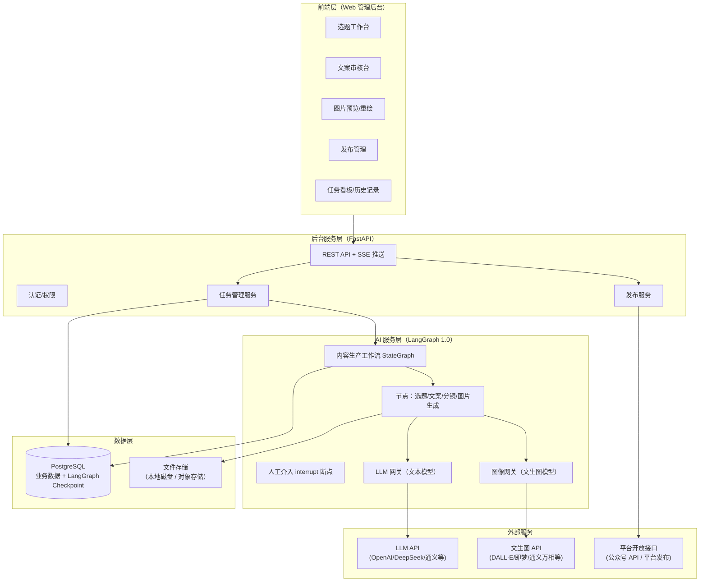
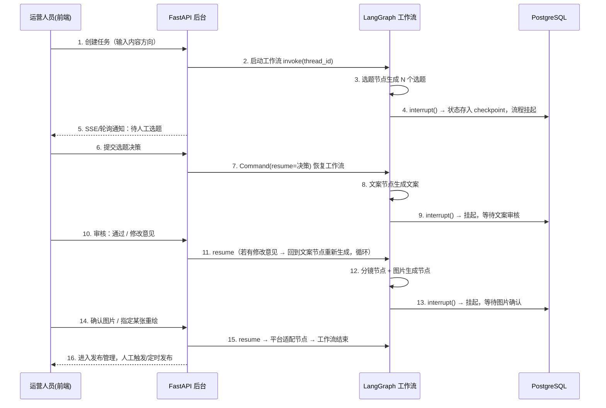
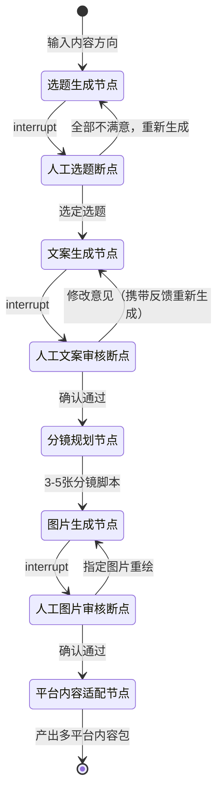
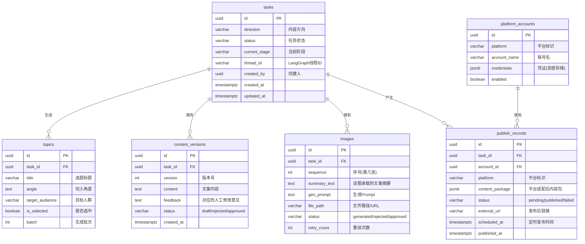

# 美妆自媒体运营 AI Agent — 整体方案设计

> 版本：v1.0　|　日期：2026-07-08　|　技术栈：Python + LangGraph 1.0 + FastAPI + PostgreSQL + LLM API

---

## 目录

1. [项目概述](#1-项目概述)
2. [整体架构设计](#2-整体架构设计)
3. [核心业务流程设计（LangGraph 工作流）](#3-核心业务流程设计langgraph-工作流)
4. [项目代码结构设计](#4-项目代码结构设计)
5. [数据库设计（PostgreSQL）](#5-数据库设计postgresql)
6. [API 接口设计](#6-api-接口设计)
7. [关键技术方案说明](#7-关键技术方案说明)
8. [扩展性设计](#8-扩展性设计)
9. [部署方案](#9-部署方案)
10. [开发迭代计划](#10-开发迭代计划)

---

## 1. 项目概述

### 1.1 项目背景

美妆自媒体公司需要每天在小红书、抖音、快手等平台发布化妆品类图文内容。本项目构建一个 **人机协作（Human-in-the-Loop）** 的内容生产流水线 AI Agent，实现从「选题 → 文案 → 配图 → 多平台分发」的半自动化内容生产。

### 1.2 核心功能

| 编号 | 功能 | 说明 |
|------|------|------|
| F1 | 选题生成 | 运营人员输入一个内容方向（如"秋冬干皮粉底液"），AI 生成 N 个候选选题 |
| F2 | 人工选题 | 人工从候选选题中选择一个（或修改后确认），流程才继续 |
| F3 | 文案生成与迭代 | AI 根据选题生成文案；人工审核，不满意则提出修改意见，AI 重新生成，循环直到人工确认 |
| F4 | 配图生成 | AI 将确认后的文案（如 1000 字）提炼为 3-5 张图片的分镜脚本，逐张生成图片（文案精简版卡片图/场景图） |
| F5 | 多平台分发 | 图片 → 小红书/抖音/快手；文案 → 微信公众号等图文平台。各平台内容自动做格式适配 |

### 1.3 设计原则

- **人机协作优先**：关键决策点（选题、文案定稿、发布确认）必须人工介入，利用 LangGraph 的 `interrupt` 机制实现流程暂停与恢复。
- **状态可持久化**：所有工作流状态落地 PostgreSQL，服务重启后任务可恢复，支持长时间挂起（人工可能第二天才来审核）。
- **平台可插拔**：新增自媒体平台只需新增一个适配器，不改动核心流程。
- **模型可替换**：LLM / 文生图模型通过统一网关层接入，可随时切换供应商。
- **前后端与 AI 编排解耦**：AI 工作流独立成层，未来可单独扩容或替换。

---

## 2. 整体架构设计

### 2.1 架构总览



### 2.2 分层职责

| 层 | 职责 | 关键点 |
|----|------|--------|
| **前端层** | 运营人员操作界面 | 选题选择、文案审核（含修改意见输入）、图片预览与单张重绘、发布管理、任务列表 |
| **后台服务层（FastAPI）** | 对外 API、任务生命周期管理、发布调度 | 不含 AI 逻辑；负责把人工决策转发给 AI 层（恢复被中断的工作流） |
| **AI 服务层（LangGraph）** | 内容生产工作流编排 | StateGraph 定义流程；`interrupt()` 实现人工断点；PostgresSaver 做 checkpoint 持久化 |
| **数据层** | 数据持久化 | 业务表（任务/选题/文案/图片/发布记录）+ LangGraph checkpoint 表 + 图片文件存储 |

### 2.3 关键交互模式：人工介入（HITL）

这是本项目最核心的机制，前后端与 AI 层的协作方式如下：



---

## 3. 核心业务流程设计（LangGraph 工作流）

### 3.1 工作流状态图



### 3.2 节点设计说明

| 节点 | 类型 | 输入 | 输出 | 说明 |
|------|------|------|------|------|
| `topic_generator` 选题生成 | LLM 节点 | 内容方向、品类知识、历史爆款参考 | N 个候选选题（标题+角度+目标人群） | Prompt 中注入美妆领域知识与平台调性 |
| `topic_selection` 人工选题 | interrupt 断点 | 候选选题列表 | 人工决策（选中项 / 重新生成指令） | 支持人工微调选题文字后确认 |
| `content_writer` 文案生成 | LLM 节点 | 选定选题、修改意见历史 | 完整文案（约 1000 字） | 首次生成走"创作 Prompt"；带反馈时走"修订 Prompt"，反馈历史累积在 State 中 |
| `content_review` 人工文案审核 | interrupt 断点 | 文案 | 通过 / 修改意见 | 循环次数记入 State，可设上限告警 |
| `storyboard_planner` 分镜规划 | LLM 节点 | 定稿文案 | 3-5 张图片的分镜脚本（每张：核心文字摘要 + 画面描述 + 图片生成 Prompt） | 将 1000 字文案压缩为图片序列的"精简版"叙事 |
| `image_generator` 图片生成 | 文生图节点 | 分镜脚本 | 3-5 张图片 URL | 并发生成；失败单张重试 |
| `image_review` 人工图片审核 | interrupt 断点 | 图片列表 | 通过 / 指定序号重绘（可附修改描述） | 只重绘指定图片，不推翻全部 |
| `platform_adapter` 平台内容适配 | LLM 节点（并行扇出） | 定稿文案 + 图片 | 各平台内容包 | 小红书（标题+正文+话题标签+图）、抖音/快手（图集+短文案）、公众号（长图文排版） |

### 3.3 State（工作流状态）设计

工作流 State 是贯穿全流程的数据载体（概念结构，非代码）：

```
ContentTaskState
├── task_id                 业务任务 ID（关联业务表）
├── direction               用户输入的内容方向
├── topics: []              候选选题列表
├── selected_topic          人工选定的选题
├── content_draft           当前文案
├── review_feedbacks: []    历次人工修改意见（累积，供修订 Prompt 使用）
├── revision_count          文案修订轮次
├── storyboard: []          分镜脚本
├── images: []              图片信息（url、prompt、状态、重绘次数）
├── platform_contents: {}   各平台适配后的内容包
└── current_stage           当前阶段标识（供前端展示进度）
```

### 3.4 LangGraph 1.0 关键机制运用

| 机制 | 用途 |
|------|------|
| `StateGraph` | 定义上述节点与边，条件边实现"审核通过→下一步 / 不通过→回退重生成"的循环 |
| `interrupt()` | 三个人工断点（选题/文案/图片），流程挂起并将等待信息暴露给后台服务 |
| `Command(resume=...)` | 后台服务收到前端人工决策后，恢复工作流并注入决策数据 |
| `PostgresSaver` (checkpointer) | 每个任务对应一个 `thread_id`；状态持久化到 PostgreSQL，支持跨天挂起、服务重启恢复、历史回溯（time-travel） |
| `Send` / 并行分支 | 图片生成节点并发出图；平台适配节点并行生成多平台内容 |
| 子图（Subgraph） | 图片生产（分镜→生成→审核）封装为子图，未来可独立复用（如"只重新出图"场景） |

---

## 4. 项目代码结构设计

采用 **单仓库（Monorepo）+ 分层模块化** 结构，前端与后端分离，后端内部按"接口层 / 业务层 / AI 编排层 / 基础设施层"划分，保证未来功能扩展时"加文件不改文件"。

```
media-ai-agent/
├── README.md
├── docker-compose.yml                # PostgreSQL / 后端 / 前端 一键编排
├── .env.example                      # 环境变量模板（数据库、LLM Key 等）
│
├── backend/                          # 后端（FastAPI + LangGraph）
│   ├── pyproject.toml                # 依赖管理（推荐 uv / poetry）
│   ├── alembic/                      # 数据库迁移脚本
│   │   └── versions/
│   ├── app/
│   │   ├── main.py                   # FastAPI 应用入口
│   │   ├── config.py                 # 配置管理（Pydantic Settings，读 .env）
│   │   │
│   │   ├── api/                      # ── 接口层 ──
│   │   │   ├── deps.py               # 依赖注入（DB 会话、当前用户等）
│   │   │   └── v1/                   # API 版本化，未来 v2 平滑演进
│   │   │       ├── router.py         # 路由聚合
│   │   │       ├── tasks.py          # 任务：创建/列表/详情/取消
│   │   │       ├── workflow.py       # 工作流：状态查询、人工决策提交(resume)
│   │   │       ├── contents.py       # 内容资产：选题/文案/图片查询
│   │   │       ├── publish.py        # 发布：发布/定时/记录查询
│   │   │       ├── platforms.py      # 平台账号配置管理
│   │   │       └── events.py         # SSE 事件流（任务状态实时推送）
│   │   │
│   │   ├── schemas/                  # ── Pydantic 数据契约 ──
│   │   │   ├── task.py
│   │   │   ├── workflow.py           # 人工决策请求体（选题/审核/重绘）
│   │   │   ├── content.py
│   │   │   └── publish.py
│   │   │
│   │   ├── services/                 # ── 业务服务层 ──
│   │   │   ├── task_service.py       # 任务生命周期：创建任务→启动工作流
│   │   │   ├── workflow_service.py   # 工作流控制：查询挂起点、resume、回溯
│   │   │   ├── content_service.py    # 内容资产读写
│   │   │   ├── publish_service.py    # 发布编排：调平台适配器、记录结果
│   │   │   └── event_service.py      # 事件发布（供 SSE 消费）
│   │   │
│   │   ├── agent/                    # ── AI 编排层（LangGraph）──
│   │   │   ├── graph.py              # 主工作流 StateGraph 组装与编译
│   │   │   ├── state.py              # ContentTaskState 定义
│   │   │   ├── checkpointer.py       # PostgresSaver 初始化
│   │   │   ├── nodes/                # 节点实现（一节点一文件）
│   │   │   │   ├── topic_generator.py
│   │   │   │   ├── content_writer.py
│   │   │   │   ├── storyboard_planner.py
│   │   │   │   ├── image_generator.py
│   │   │   │   ├── platform_adapter.py
│   │   │   │   └── human_gates.py    # 三个 interrupt 断点节点
│   │   │   ├── subgraphs/            # 子图（图片生产子图等）
│   │   │   │   └── image_pipeline.py
│   │   │   ├── prompts/              # Prompt 模板集中管理（版本化）
│   │   │   │   ├── topic.py
│   │   │   │   ├── content.py
│   │   │   │   ├── storyboard.py
│   │   │   │   └── platform/         # 各平台文案风格 Prompt
│   │   │   │       ├── xiaohongshu.py
│   │   │   │       ├── douyin.py
│   │   │   │       └── wechat_mp.py
│   │   │   └── edges.py              # 条件边路由逻辑
│   │   │
│   │   ├── llm/                      # ── 模型网关层 ──
│   │   │   ├── text/                 # 文本 LLM
│   │   │   │   ├── base.py           # 抽象接口（chat / structured output）
│   │   │   │   ├── openai_provider.py
│   │   │   │   ├── deepseek_provider.py
│   │   │   │   └── factory.py        # 按配置实例化，支持节点级模型路由
│   │   │   └── image/                # 文生图
│   │   │       ├── base.py           # 抽象接口（generate / edit）
│   │   │       ├── dalle_provider.py
│   │   │       ├── jimeng_provider.py
│   │   │       └── factory.py
│   │   │
│   │   ├── publishers/               # ── 平台发布适配器（插件式）──
│   │   │   ├── base.py               # 抽象接口：格式校验/内容转换/发布/查状态
│   │   │   ├── registry.py           # 适配器注册表（新增平台在此注册）
│   │   │   ├── wechat_mp.py          # 微信公众号（API 直发）
│   │   │   ├── xiaohongshu.py        # 小红书（先做"内容包导出"，后接自动化）
│   │   │   ├── douyin.py
│   │   │   └── kuaishou.py
│   │   │
│   │   ├── models/                   # ── ORM 模型（SQLAlchemy）──
│   │   │   ├── base.py
│   │   │   ├── task.py
│   │   │   ├── topic.py
│   │   │   ├── content.py
│   │   │   ├── image.py
│   │   │   ├── publish_record.py
│   │   │   └── platform_account.py
│   │   │
│   │   ├── repositories/             # ── 数据访问层 ──
│   │   │   ├── task_repo.py
│   │   │   ├── content_repo.py
│   │   │   └── publish_repo.py
│   │   │
│   │   └── core/                     # ── 基础设施 ──
│   │       ├── database.py           # 数据库连接/会话管理
│   │       ├── storage.py            # 文件存储抽象（本地/OSS 可切换）
│   │       ├── logging.py            # 结构化日志
│   │       ├── exceptions.py         # 统一异常与错误码
│   │       └── security.py           # 认证鉴权
│   │
│   └── tests/                        # 测试（与 app 目录结构镜像）
│       ├── test_agent/
│       ├── test_api/
│       └── test_publishers/
│
├── frontend/                         # 前端（推荐 Vue3/React + TypeScript）
│   ├── package.json
│   └── src/
│       ├── api/                      # 后端接口封装 + SSE 客户端
│       ├── views/
│       │   ├── dashboard/            # 任务看板
│       │   ├── task-detail/          # 任务详情（分阶段展示流水线进度）
│       │   ├── topic-select/         # 选题工作台
│       │   ├── content-review/       # 文案审核台（对比历史版本、提修改意见）
│       │   ├── image-review/         # 图片预览与重绘
│       │   └── publish/              # 发布管理与平台账号配置
│       ├── components/
│       └── stores/                   # 状态管理
│
└── docs/                             # 项目文档
    ├── 项目方案设计.md               # 本文档
    ├── api.md                        # 接口文档
    └── deployment.md                 # 部署文档
```

### 4.1 结构设计要点

1. **`agent/` 与 `services/` 分离**：LangGraph 编排逻辑不直接被 API 调用，统一经 `workflow_service` 中转。未来 AI 服务需要独立部署时，只需把 `agent/` + `llm/` 抽出为独立服务，`workflow_service` 改为 RPC 调用即可。
2. **一节点一文件**：新增流程环节（如"竞品分析节点""标题党检测节点"）只需在 `nodes/` 加文件并在 `graph.py` 接线。
3. **Prompt 集中管理**：所有 Prompt 在 `prompts/` 目录版本化管理，方便运营侧调优而不碰业务代码；未来可升级为数据库存储 + 后台可视化编辑。
4. **双工厂模式（`llm/`）**：文本模型与图像模型各自有 provider 抽象 + 工厂。支持"选题用便宜模型、文案用高质量模型"这类节点级模型路由，也支持一键切换供应商。
5. **发布适配器注册表（`publishers/`）**：`base.py` 定义统一接口（内容格式转换、发布、状态查询），`registry.py` 集中注册。新增 B 站、微博等平台 = 新增一个文件 + 注册一行。
6. **API 版本化（`api/v1/`）**：接口演进不破坏已有前端。

---

## 5. 数据库设计（PostgreSQL）

### 5.1 表结构总览

分两类：**业务表**（自建）与 **LangGraph checkpoint 表**（由 PostgresSaver 自动建表管理，如 `checkpoints`、`checkpoint_writes` 等，不手工干预）。



### 5.2 设计要点

- **`tasks.thread_id`**：业务任务与 LangGraph checkpoint 线程的关联键，是"业务世界"与"AI 工作流世界"的桥梁。
- **`content_versions` 保留全部版本**：每轮人工反馈 + AI 重写都留档，支持版本对比、回滚，也为未来"从历史优质文案中学习偏好"积累数据。
- **`publish_records.content_package` 用 JSONB**：各平台内容结构差异大（小红书要话题标签、公众号要富文本），JSONB 灵活承载，不必为每个平台建表。
- **凭证加密**：`platform_accounts.credentials` 应用层加密后入库。
- **未来扩展预留**：用户体系（多运营人员协作）、内容标签体系（品类/风格标签，用于数据分析）可作为独立表平滑加入。

---

## 6. API 接口设计

RESTful 风格，统一前缀 `/api/v1`。

### 6.1 任务与工作流

| 方法 | 路径 | 说明 |
|------|------|------|
| POST | `/tasks` | 创建任务（body: 内容方向），后台启动工作流，返回 task_id |
| GET | `/tasks` | 任务列表（分页、按状态/阶段筛选） |
| GET | `/tasks/{id}` | 任务详情（含当前阶段、挂起等待的人工操作类型及待决策数据） |
| POST | `/tasks/{id}/cancel` | 取消任务 |
| GET | `/tasks/{id}/events` | SSE 事件流：阶段变更、生成进度实时推送前端 |

### 6.2 人工决策（工作流 resume 入口，核心接口）

| 方法 | 路径 | 说明 |
|------|------|------|
| POST | `/tasks/{id}/decisions/topic` | 提交选题决策：`{选中的选题id 或 "重新生成"+补充要求}` |
| POST | `/tasks/{id}/decisions/content` | 提交文案审核：`{approved: true}` 或 `{approved: false, feedback: "修改意见"}` |
| POST | `/tasks/{id}/decisions/images` | 提交图片审核：`{approved: true}` 或 `{redraw: [{序号, 修改描述}]}` |

> 三个决策接口内部统一走 `workflow_service.resume(thread_id, decision)`，用 `Command(resume=...)` 唤醒对应 interrupt 断点。

### 6.3 内容资产

| 方法 | 路径 | 说明 |
|------|------|------|
| GET | `/tasks/{id}/topics` | 候选选题列表 |
| GET | `/tasks/{id}/contents` | 文案版本列表（含各版本反馈意见） |
| GET | `/tasks/{id}/images` | 图片列表 |
| GET | `/tasks/{id}/platform-contents` | 各平台适配后的内容包预览 |

### 6.4 发布

| 方法 | 路径 | 说明 |
|------|------|------|
| POST | `/tasks/{id}/publish` | 发布（body: 目标平台列表、账号、立即/定时） |
| GET | `/tasks/{id}/publish-records` | 发布记录与状态 |
| GET/POST/PUT | `/platform-accounts` | 平台账号配置管理 |

---

## 7. 关键技术方案说明

### 7.1 LangGraph 持久化与"跨天审核"

- 使用 `PostgresSaver` 作为 checkpointer，与业务库共用一个 PostgreSQL 实例（独立 schema，如 `langgraph`）。
- 工作流在 interrupt 处挂起后 **不占用任何进程资源**，状态完全在数据库中；人工哪怕一周后审核，`resume` 时从 checkpoint 原地恢复。
- 服务重启、部署更新均不丢任务状态。
- checkpoint 天然支持 **time-travel**：可回溯到"文案第 2 版"的状态点重新分叉，支撑"回退重做"类需求。

### 7.2 文案修改循环的实现

- `content_review` 断点返回的人工反馈写入 State 的 `review_feedbacks` 列表。
- 条件边判断：`approved` → 进入分镜规划；否则 → 回到 `content_writer`。
- `content_writer` 检测到反馈历史非空时，切换为"修订 Prompt"：携带当前文案 + 全部历史反馈，做**增量修改**而非重写，保证已满意的部分不被破坏。
- `revision_count` 超过阈值（如 5 轮）时在前端提示"建议重选选题或人工手改"。

### 7.3 图片生成策略（文案 → 3-5 张图）

两阶段设计，**分镜与出图分离**：

1. **分镜规划（LLM）**：将 1000 字文案压缩为 3-5 张图的叙事序列。每张分镜产出三要素：
   - `summary_text`：该图承载的文案精简文字（将渲染到图上或作为图注）
   - `visual_desc`：画面内容描述
   - `gen_prompt`：优化后的文生图 Prompt（含统一风格约束，保证整组图风格一致）
2. **图片生成（文生图 API）**：按分镜并发出图。

好处：人工审核不满意时，可以只改分镜文字、只重绘某一张，两个环节独立可控。

> 图上文字渲染方案：文生图模型直出中文文字目前不稳定，推荐 **底图生成 + 程序化文字排版**（Pillow 合成）两步走，保证文字准确性；此逻辑封装在 `image_generator` 节点内部，未来模型能力提升可无缝切换为直出。

### 7.4 多平台内容适配

`platform_adapter` 节点按目标平台**并行**产出内容包：

| 平台 | 内容包结构 | 发布方式（分阶段） |
|------|-----------|------------------|
| 小红书 | 吸睛标题(≤20字) + 正文(带 emoji、话题标签) + 图片组 | 一期：内容包导出+人工粘贴；二期：自动化发布 |
| 抖音/快手 | 图集 + 短文案 + 话题 | 同上 |
| 微信公众号 | 长图文（富文本排版）+ 封面图 | 一期即可 API 直发（公众号有官方接口） |

> 小红书/抖音/快手无官方内容发布 API，一期以"生成合规内容包 + 一键复制/导出"落地，规避封号风险；自动化发布（如基于 RPA/开放平台）作为二期独立模块，插在 `publishers/` 适配器后面即可，不影响主流程。

### 7.5 实时性方案

- AI 生成过程较长（文案 30s+、图片 1-2min），前端通过 **SSE** 订阅任务事件流获取阶段进度；LLM 文案生成可流式 token 推送提升体验。
- FastAPI 全异步（async SQLAlchemy + asyncpg），工作流执行放入后台任务，API 请求即刻返回。

---

## 8. 扩展性设计

| 未来需求 | 扩展方式 | 是否改动核心 |
|----------|----------|-------------|
| 新增自媒体平台（B 站/微博） | `publishers/` 新增适配器 + `prompts/platform/` 新增风格模板 | 否 |
| 更换/新增 LLM 或文生图供应商 | `llm/` 新增 provider，改配置 | 否 |
| 新增流程环节（热点分析、合规审核、标题 AB 测试） | `nodes/` 新增节点，`graph.py` 接线 | 仅接线 |
| 视频内容生产（图文转视频） | 新增 `video_pipeline` 子图 + 视频生成网关 | 否 |
| 爆款数据回流（发布后数据分析反哺选题） | 新增数据采集服务 + 选题节点 Prompt 注入历史表现数据 | 否 |
| 多账号/多团队协作 | 用户/权限模型扩展，任务加 owner | 否 |
| 批量生产（一天 N 篇排产） | 任务服务上加排产调度器（如 APScheduler），批量创建任务 | 否 |
| AI 服务独立部署/扩容 | `agent/` + `llm/` 抽出为独立服务，`workflow_service` 改远程调用 | 架构已预留 |
| 记忆与偏好学习（越用越懂你） | 引入 LangGraph Store（长期记忆），沉淀"人工反馈偏好"，注入生成 Prompt | 否 |

---

## 9. 部署方案

### 9.1 一期（本地/单机）

```
docker-compose
├── postgres:16          # 业务库 + LangGraph checkpoint（独立 schema）
├── backend (FastAPI)    # uvicorn，含 LangGraph 工作流
├── frontend (nginx)     # 静态资源 + API 反向代理
└── volume: ./data/images  # 图片本地存储
```

### 9.2 环境变量清单（`.env`）

- 数据库：`DATABASE_URL`
- 文本 LLM：`LLM_PROVIDER`、`LLM_API_KEY`、`LLM_BASE_URL`、`LLM_MODEL`（可按节点细分）
- 文生图：`IMAGE_PROVIDER`、`IMAGE_API_KEY`、`IMAGE_MODEL`
- 存储：`STORAGE_TYPE`（local/oss）及对应配置
- 平台：公众号 AppID/Secret 等（也可全部走数据库 `platform_accounts` 管理）

### 9.3 二期演进

- 图片存储迁移对象存储（OSS/MinIO）
- AI 服务独立部署，水平扩容
- 增加任务队列（如 ARQ/Celery）承载批量排产

---

## 10. 开发迭代计划

| 阶段 | 内容 | 交付物 |
|------|------|--------|
| **M1 骨架**（1 周） | 项目脚手架、数据库建模与迁移、FastAPI 基础框架、LangGraph 最小工作流（选题→文案，含一个 interrupt 断点）跑通 | 端到端"创建任务→生成选题→人工选题→出文案"闭环（可先用 API 工具代替前端） |
| **M2 核心流程**（2 周） | 文案审核循环、分镜规划、图片生成与重绘、PostgresSaver 持久化恢复验证 | 完整内容生产流水线 |
| **M3 前端**（2 周） | 任务看板、选题/文案/图片三个审核工作台、SSE 实时进度 | 运营人员可用的 Web 后台 |
| **M4 分发**（1-2 周） | 平台适配节点、公众号 API 直发、小红书等平台内容包导出 | 多平台分发能力 |
| **M5 打磨**（持续） | Prompt 调优、批量排产、数据回流、自动化发布探索 | 生产可用版本 |

---

## 附：技术选型清单

| 类别 | 选型 | 说明 |
|------|------|------|
| AI 编排 | LangGraph 1.0（`langgraph`、`langgraph-checkpoint-postgres`） | StateGraph + interrupt + PostgresSaver |
| LLM 接入 | `langchain-openai` 等（OpenAI 兼容协议） | 便于切换 DeepSeek/通义/Kimi 等国产模型 |
| Web 框架 | FastAPI + uvicorn | 全异步 |
| ORM/迁移 | SQLAlchemy 2.0 (async) + Alembic | |
| 数据库 | PostgreSQL 16 | 业务数据 + checkpoint 一库两 schema |
| 数据校验 | Pydantic v2 | |
| 图片处理 | Pillow | 文字排版合成 |
| 前端 | Vue3 / React + TypeScript + 组件库（Element Plus / Ant Design） | 二选一均可 |
| 部署 | Docker Compose | 一期单机 |
